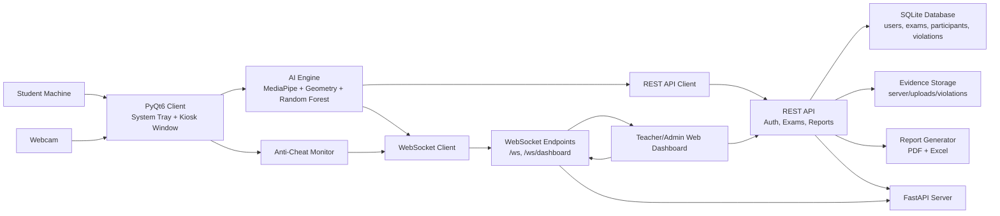
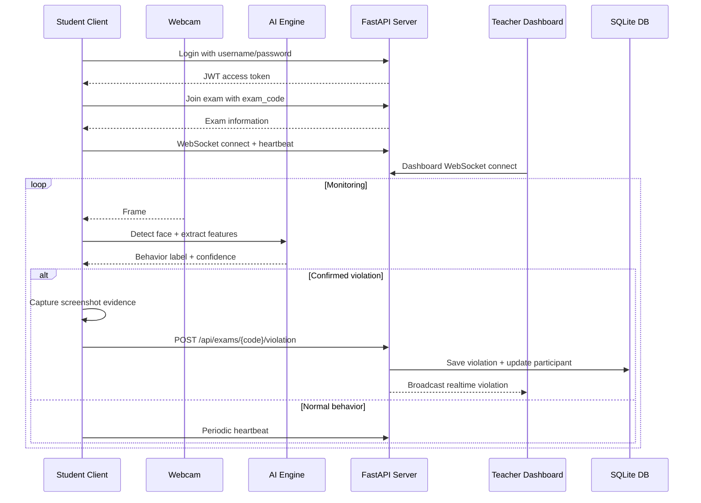

# FocusGuard - Smart Examiner

FocusGuard is an AI-powered exam proctoring system that uses computer vision, machine learning, realtime networking, and anti-cheat monitoring to help teachers supervise students during online or computer-based exams. The project includes a student client, a FastAPI backend, teacher/admin dashboards, a SQLite database, evidence capture, report generation, and an ML training pipeline.

## Table of Contents

- [Key Features](#key-features)
- [System Architecture](#system-architecture)
- [Project Structure](#project-structure)
- [System Requirements](#system-requirements)
- [Quick Start](#quick-start)
- [Environment Configuration](#environment-configuration)
- [Running the System](#running-the-system)
- [Accounts and Workflow](#accounts-and-workflow)
- [Main API Endpoints](#main-api-endpoints)
- [AI Proctoring Pipeline](#ai-proctoring-pipeline)
- [Database](#database)
- [Testing](#testing)
- [Build and Packaging](#build-and-packaging)
- [Troubleshooting](#troubleshooting)
- [Additional Documentation](#additional-documentation)
- [License](#license)

## Key Features

- Face detection with MediaPipe Face Landmarker.
- Facial landmark extraction, head pose estimation, gaze analysis, and mouth aspect ratio calculation.
- Behavior classification with a trained Random Forest model.
- Detection of core behaviors: normal, looking left, looking right, and head down.
- Noise filtering based on consecutive frames and continuous violation duration to reduce false positives.
- Screenshot evidence capture when a violation is detected.
- Realtime WebSocket communication between student clients and teacher dashboards.
- Role-based account management for admin, teacher, and student users.
- Exam management with 6-character exam codes.
- Web dashboard for login, exam management, student monitoring, and violation review.
- Kiosk mode and basic anti-cheat monitoring: fullscreen exam window, focus loss detection, minimize detection, multiple-monitor detection, and additional shortcut blocking on Windows.
- PDF and Excel report generation.
- Deployment scripts for Windows and Linux/macOS, plus Windows installer packaging support.

## System Architecture

### Component Overview



### Exam Monitoring Data Flow



### Main Layers

| Layer | Directory/File | Responsibility |
|---|---|---|
| Client UI | `client/main.py`, `client/gui/` | Login, exam join flow, system tray app, kiosk window |
| AI Engine | `client/ai_engine/` | Face detection, geometric feature extraction, behavior classification, screenshot evidence |
| Anti-cheat | `client/anti_cheat.py` | Focus/minimize/multiple-monitor monitoring and selected Windows shortcut blocking |
| Network Client | `client/network/websocket_client.py` | Realtime WebSocket connection, heartbeat, reconnect logic |
| Server App | `server/main.py` | FastAPI app, WebSocket manager, route registration |
| Auth API | `server/auth.py`, `server/auth_routes.py` | JWT authentication, role-based access control, user management |
| Exam API | `server/exam_routes.py` | Exam creation, join/start/end actions, violation recording |
| Report API | `server/report_routes.py`, `server/reports.py` | Statistics, PDF reports, Excel reports |
| Database | `server/database.py` | SQLAlchemy models and SQLite sessions |
| Shared | `shared/` | Constants, message types, logging configuration |
| ML | `ml/` | Training data, training scripts, model artifacts |
| Tests | `tests/` | Integration, latency, stress, database, report, and anti-cheat tests |

## Project Structure

```text
smart-examiner-project/
├── client/
│   ├── ai_engine/
│   │   ├── face_detector.py
│   │   ├── geometry.py
│   │   ├── classifier.py
│   │   └── screenshot.py
│   ├── gui/
│   │   ├── login_dialog.py
│   │   ├── exam_dialog.py
│   │   └── tray_app.py
│   ├── network/
│   │   └── websocket_client.py
│   ├── anti_cheat.py
│   └── main.py
├── server/
│   ├── main.py
│   ├── database.py
│   ├── auth.py
│   ├── auth_routes.py
│   ├── exam_routes.py
│   ├── report_routes.py
│   ├── reports.py
│   ├── templates/
│   ├── uploads/
│   └── focusguard.db
├── shared/
│   ├── constants.py
│   └── logging_config.py
├── ml/
│   ├── collect_data.py
│   ├── train_model.py
│   ├── data/
│   └── models/
├── tests/
├── docs/
├── run_server.py
├── run_client.py
├── run_dashboard.py
├── deploy.bat
├── deploy.sh
├── build.py
├── build_windows.bat
├── requirements.txt
└── README.md
```

## System Requirements

### Software

- Python 3.10 or newer is recommended.
- pip and venv.
- A working webcam.
- A modern web browser for the dashboard.
- Windows is recommended for the full kiosk and OS-level anti-cheat behavior.

### Main Python Packages

The project uses these main dependency groups:

- Computer vision: `opencv-python`, `mediapipe`, `numpy`
- Machine learning: `scikit-learn`, `joblib`
- GUI: `PyQt6`
- Backend: `fastapi`, `uvicorn`, `websockets`
- Database: `sqlalchemy`
- Authentication: `bcrypt`, `python-jose`
- Reports: `reportlab`, `openpyxl`
- Testing: `pytest`, `pytest-asyncio`, `requests`, `httpx`

All dependencies are listed in `requirements.txt`.

## Quick Start

### Windows

```bat
cd smart-examiner-project
deploy.bat install
deploy.bat server
```

Open a new terminal to run the student client:

```bat
cd smart-examiner-project
deploy.bat client
```

### Linux/macOS

```bash
cd smart-examiner-project
chmod +x deploy.sh
./deploy.sh install
./deploy.sh server
```

Open a new terminal to run the student client:

```bash
cd smart-examiner-project
./deploy.sh client
```

### Manual Setup with venv

Windows:

```bat
cd smart-examiner-project
python -m venv venv
venv\Scripts\activate
pip install --upgrade pip
pip install -r requirements.txt
python run_server.py
```

Linux/macOS:

```bash
cd smart-examiner-project
python3 -m venv venv
source venv/bin/activate
pip install --upgrade pip
pip install -r requirements.txt
python run_server.py
```

## Environment Configuration

The server reads configuration from environment variables and from a `.env` file in the project root if one exists.

Example `.env`:

```env
JWT_SECRET_KEY=change-this-to-a-long-random-secret
SERVER_HOST=0.0.0.0
SERVER_PORT=8000
DEBUG=true
CORS_ORIGINS=*
FOCUSGUARD_DB_PATH=server/focusguard.db
CAMERA_INDEX=0
```

Important variables:

| Variable | Default | Meaning |
|---|---|---|
| `JWT_SECRET_KEY` | auto-generated | Secret used to sign JWT tokens. Use a fixed value in real deployments. |
| `SERVER_HOST` | `0.0.0.0` | Server bind address. |
| `SERVER_PORT` | `8000` | HTTP/WebSocket port. |
| `DEBUG` | `true` | Debug mode flag. |
| `CORS_ORIGINS` | `*` | Allowed API origins. |
| `FOCUSGUARD_DB_PATH` | `server/focusguard.db` | SQLite database path used by `server/database.py`. |
| `CAMERA_INDEX` | `0` | Default webcam index. |

Note: if `JWT_SECRET_KEY` is not set, the server generates a new secret on every startup. Existing tokens become invalid after a restart.

## Running the System

### 1. Start the server

```bash
python run_server.py
```

Default server URLs:

- API root: `http://localhost:8000/`
- Web login: `http://localhost:8000/login`
- Dashboard: `http://localhost:8000/dashboard`
- Admin panel: `http://localhost:8000/admin`
- Exams page: `http://localhost:8000/exams`

When the server starts, it initializes the database if needed and creates the default admin account if it does not already exist.

### 2. Start the student client

```bash
python run_client.py
```

Useful options:

```bash
python run_client.py --server 127.0.0.1:8000
python run_client.py --student-id student01 --skip-login
```

Normal client flow:

1. The login dialog opens.
2. The student signs in with an account created by an admin or teacher.
3. The student enters the exam code.
4. The client opens the kiosk window for a real student exam.
5. The AI engine starts reading webcam frames and reporting violations to the server.

### 3. Start the desktop dashboard

```bash
python run_dashboard.py
```

This entrypoint calls `gui/dashboard.py`. The project also includes web dashboard templates under `server/templates/`.

### 4. Test the camera and face detector

```bash
python test_face_detector.py
```

This script opens the webcam, runs MediaPipe Face Landmarker, and draws facial landmarks on the live frame. Press `q` to quit.

## Accounts and Workflow

### Default Account

When the database is initialized, the system creates this default admin account:

```text
Username: admin
Password: admin123
Role: admin
```

The default account is marked with `must_change_password=True`, so the password should be changed immediately in a real environment.

### Roles

| Role | Main Permissions |
|---|---|
| `admin` | Manage users, create teacher/student accounts, manage exams, view reports |
| `teacher` | Create and manage owned exams, view participants, violations, and reports |
| `student` | Sign in through the client, join exams, and be monitored during exams |

### Recommended Workflow

1. Admin signs in to the dashboard.
2. Admin creates teacher and student accounts.
3. Teacher signs in and creates an exam.
4. Teacher gives the generated `exam_code` to students.
5. Student runs the client, signs in, and joins the exam with the `exam_code`.
6. Teacher opens the dashboard to monitor connections and violations in realtime.
7. After the exam, teacher downloads PDF or Excel reports.

## Main API Endpoints

### Auth

| Method | Endpoint | Description |
|---|---|---|
| `POST` | `/api/auth/login` | Sign in and receive a JWT token |
| `GET` | `/api/auth/me` | Get the current user profile |
| `POST` | `/api/auth/change-password` | Change the current user's password |
| `POST` | `/api/auth/users` | Create a new user, admin only |
| `GET` | `/api/auth/users` | List users, admin/teacher |
| `POST` | `/api/auth/users/bulk` | Create multiple users, admin only |

### Exams

| Method | Endpoint | Description |
|---|---|---|
| `POST` | `/api/exams` | Create a new exam |
| `GET` | `/api/exams` | List exams |
| `GET` | `/api/exams/{exam_code}` | Get exam details |
| `POST` | `/api/exams/{exam_code}/join` | Join an exam as a student |
| `POST` | `/api/exams/{exam_code}/start` | Start an exam |
| `POST` | `/api/exams/{exam_code}/end` | End an exam |
| `GET` | `/api/exams/{exam_code}/participants` | List exam participants |
| `POST` | `/api/exams/{exam_code}/violation` | Record a violation |
| `GET` | `/api/exams/{exam_code}/violations` | List exam violations |

### Reports

| Method | Endpoint | Description |
|---|---|---|
| `GET` | `/api/reports/{exam_code}/pdf` | Download the PDF report |
| `GET` | `/api/reports/{exam_code}/excel` | Download the Excel report |
| `GET` | `/api/reports/{exam_code}/statistics` | Get exam statistics |

### WebSocket

| Endpoint | Description |
|---|---|
| `/ws` | Student clients connect here and send connect/heartbeat/violation messages |
| `/ws/dashboard` | Dashboards connect here to receive realtime student status and violations |

## AI Proctoring Pipeline

The client-side pipeline runs inside `ProctorEngine`:

1. Read frames from the webcam using OpenCV.
2. Use MediaPipe Face Landmarker to extract facial landmarks.
3. Calculate geometric features:
   - pitch, yaw, and roll from PnP head pose estimation;
   - eye gaze ratio;
   - iris gaze;
   - mouth aspect ratio.
4. Pass the feature vector to `BehaviorClassifier`.
5. Apply rule-based overrides for selected gaze and head-down cases where a stricter signal is useful.
6. Use `ViolationDetector` to confirm a violation across consecutive frames and continuous duration.
7. When a violation is confirmed:
   - capture the current frame;
   - overlay the violation name and timestamp;
   - encode the JPEG image as base64;
   - send a REST request to `/api/exams/{exam_code}/violation`;
   - let the server save the violation record, store the evidence image, and broadcast the event to dashboards.

Current labels:

| Label | Name |
|---|---|
| `0` | Normal |
| `1` | Looking Left |
| `2` | Looking Right |
| `3` | Head Down |

## Database

The project uses SQLite through SQLAlchemy. The default database location is:

```text
server/focusguard.db
```

Main tables:

| Table | Content |
|---|---|
| `users` | Admin, teacher, and student accounts |
| `exam_sessions` | Exam metadata, exam code, teacher owner, and status |
| `exam_participants` | Student exam participation, online status, violation count |
| `violations` | Violation records, confidence, timestamp, screenshot path |

Violation evidence images are stored in:

```text
server/uploads/violations/
```

Generated reports are stored in:

```text
server/reports/
```

## Testing

Run the full test suite:

```bash
pytest
```

Run individual test groups:

```bash
pytest tests/test_integration.py -v
pytest tests/test_database.py -v
pytest tests/test_latency.py -v
pytest tests/test_stress.py -v
pytest tests/test_reports.py -v
pytest tests/test_anti_cheat.py -v
```

`tests/conftest.py` starts a test server subprocess and uses a separate test database:

```text
tests/test_focusguard.db
```

Some tests require port `8000` to be available. Stop any existing server on that port before running the tests.

## Build and Packaging

### Build Executables with PyInstaller

Install PyInstaller:

```bash
pip install pyinstaller
```

Run the build script:

```bash
python build.py
```

Useful options:

```bash
python build.py --client
python build.py --server
python build.py --all --clean
```

Note: `build.py` expects the corresponding `.spec` files to exist. If a spec file is missing, the script will report an error.

### Package a Windows Installer

On Windows:

1. Install Inno Setup 6.
2. Run:

```bat
build_windows.bat
```

3. When prompted to package a setup installer, choose `y`.

The installer configuration is stored in:

```text
installer.iss
```

## Troubleshooting

### Webcam Cannot Be Opened

- Check whether another application is already using the webcam.
- Try a different camera index.
- Run the client in test mode:

```bash
python run_client.py --skip-login --student-id TEST --server 127.0.0.1:8000
```

You can also adjust `Config.CAMERA_INDEX` in `shared/constants.py`.

### MediaPipe Model Cannot Be Downloaded

`FaceDetector` automatically downloads `face_landmarker.task` if it is missing. If the machine has no network access, place the model manually at:

```text
ml/models/face_landmarker.task
```

### Behavior Model Cannot Be Loaded

If this file is missing:

```text
ml/models/behavior_model.pkl
```

train the model again:

```bash
python ml/train_model.py
```

### Client Cannot Connect to the Server

- Confirm the server is running on the expected host and port.
- If the client runs on another machine, do not use `127.0.0.1`; use the server machine's LAN IP:

```bash
python run_client.py --server 192.168.1.10:8000
```

- Check firewall rules for port `8000`.

### Tokens Become Invalid After Server Restart

Set a fixed `JWT_SECRET_KEY` in `.env`. Otherwise, the server generates a new key on every startup.

### Windows Anti-cheat Does Not Block Some Shortcuts

Some OS-level features, such as Task Manager blocking or keyboard hooks, may require Administrator privileges and may also be limited by Windows policy settings.

### Port 8000 Is Already in Use

Change the port in `.env`:

```env
SERVER_PORT=8001
```

Then run the client with the matching port:

```bash
python run_client.py --server 127.0.0.1:8001
```

## Additional Documentation

- [Installation Guide](docs/INSTALLATION.md)
- [Teacher Manual](docs/USER_MANUAL_TEACHER.md)
- [Student Manual](docs/USER_MANUAL_STUDENT.md)

## License

MIT License. See [LICENSE](LICENSE) for details.

## Author

Viet Hoang - USTH 2026
