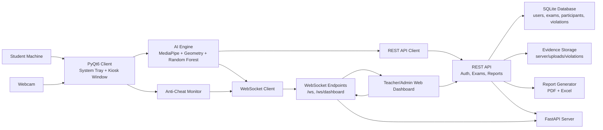
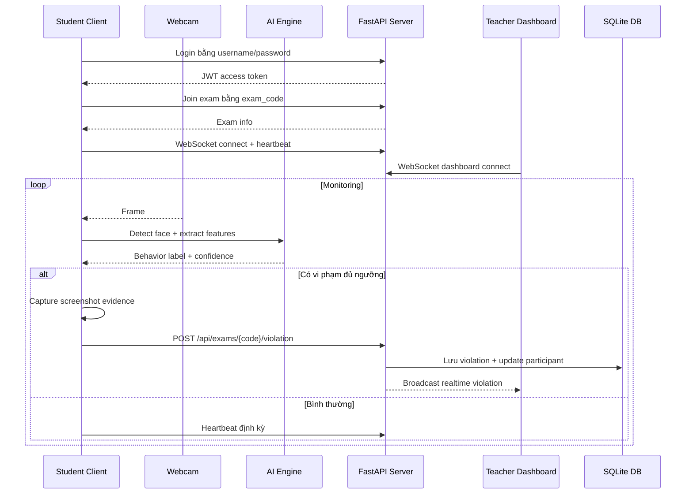

# FocusGuard - Smart Examiner

FocusGuard là hệ thống giám sát thi cử sử dụng AI, computer vision và cơ chế anti-cheat để hỗ trợ giáo viên theo dõi thí sinh trong thời gian thực. Project gồm ứng dụng client chạy trên máy sinh viên, server quản lý kỳ thi, dashboard cho giáo viên, cơ sở dữ liệu lưu tài khoản/kỳ thi/vi phạm, cùng pipeline huấn luyện model nhận diện hành vi.

## Mục Lục

- [Tính năng chính](#tính-năng-chính)
- [System Architecture](#system-architecture)
- [Cấu trúc thư mục](#cấu-trúc-thư-mục)
- [Yêu cầu hệ thống](#yêu-cầu-hệ-thống)
- [Cài đặt nhanh](#cài-đặt-nhanh)
- [Cấu hình môi trường](#cấu-hình-môi-trường)
- [Cách chạy hệ thống](#cách-chạy-hệ-thống)
- [Tài khoản và quy trình sử dụng](#tài-khoản-và-quy-trình-sử-dụng)
- [API chính](#api-chính)
- [AI proctoring pipeline](#ai-proctoring-pipeline)
- [Cơ sở dữ liệu](#cơ-sở-dữ-liệu)
- [Testing](#testing)
- [Build và đóng gói](#build-và-đóng-gói)
- [Troubleshooting](#troubleshooting)
- [Tài liệu bổ sung](#tài-liệu-bổ-sung)
- [License](#license)

## Tính Năng Chính

- Nhận diện khuôn mặt bằng MediaPipe Face Landmarker.
- Trích xuất landmark khuôn mặt, head pose, gaze và mouth aspect ratio.
- Phân loại hành vi bằng model Random Forest đã huấn luyện.
- Phát hiện các vi phạm chính: bình thường, nhìn trái, nhìn phải, cúi đầu.
- Lọc nhiễu theo số frame liên tiếp và thời lượng vi phạm để giảm false positive.
- Chụp ảnh bằng chứng khi có vi phạm và gửi về server.
- Kết nối WebSocket realtime giữa client sinh viên và dashboard giáo viên.
- Quản lý tài khoản theo vai trò: admin, teacher, student.
- Quản lý kỳ thi bằng mã exam code 6 ký tự.
- Dashboard web cho đăng nhập, quản lý kỳ thi, theo dõi sinh viên và xem vi phạm.
- Kiosk mode và anti-cheat cơ bản: fullscreen, phát hiện mất focus, minimize, nhiều màn hình; trên Windows có thêm chặn một số phím tắt hệ điều hành.
- Xuất báo cáo PDF và Excel cho kỳ thi.
- Script deploy cho Windows, Linux/macOS và script build installer Windows.

## System Architecture

### Tổng Quan Thành Phần



### Luồng Dữ Liệu Khi Thi



### Các Layer Chính

| Layer | Thư mục/File | Vai trò |
|---|---|---|
| Client UI | `client/main.py`, `client/gui/` | Login, join exam, tray app, kiosk window |
| AI Engine | `client/ai_engine/` | Face detection, geometry features, classifier, screenshot evidence |
| Anti-cheat | `client/anti_cheat.py` | Giám sát focus/minimize/multiple monitors và một số shortcut trên Windows |
| Network Client | `client/network/websocket_client.py` | WebSocket realtime, heartbeat, reconnect |
| Server App | `server/main.py` | FastAPI app, WebSocket manager, route registration |
| Auth API | `server/auth.py`, `server/auth_routes.py` | JWT auth, role-based access, user management |
| Exam API | `server/exam_routes.py` | Tạo kỳ thi, join/start/end exam, ghi nhận violation |
| Report API | `server/report_routes.py`, `server/reports.py` | Thống kê và xuất PDF/Excel |
| Database | `server/database.py` | SQLAlchemy models và SQLite session |
| Shared | `shared/` | Constants, message types, logging config |
| ML | `ml/` | Training data, train script, model artifacts |
| Tests | `tests/` | Integration, latency, stress, database, reports |

## Cấu Trúc Thư Mục

```text
smart-examiner-project/
├── client/
│   ├── ai_engine/
│   │   ├── face_detector.py
│   │   ├── geometry.py
│   │   ├── classifier.py
│   │   └── screenshot.py
│   ├── gui/
│   │   ├── login_dialog.py
│   │   ├── exam_dialog.py
│   │   └── tray_app.py
│   ├── network/
│   │   └── websocket_client.py
│   ├── anti_cheat.py
│   └── main.py
├── server/
│   ├── main.py
│   ├── database.py
│   ├── auth.py
│   ├── auth_routes.py
│   ├── exam_routes.py
│   ├── report_routes.py
│   ├── reports.py
│   ├── templates/
│   ├── uploads/
│   └── focusguard.db
├── shared/
│   ├── constants.py
│   └── logging_config.py
├── ml/
│   ├── collect_data.py
│   ├── train_model.py
│   ├── data/
│   └── models/
├── tests/
├── docs/
├── run_server.py
├── run_client.py
├── run_dashboard.py
├── deploy.bat
├── deploy.sh
├── build.py
├── build_windows.bat
├── requirements.txt
└── README.md
```

## Yêu Cầu Hệ Thống

### Phần mềm

- Python 3.10 trở lên được khuyến nghị.
- pip và venv.
- Webcam hoạt động.
- Trình duyệt web hiện đại cho dashboard.
- Windows được khuyến nghị nếu muốn dùng đầy đủ kiosk/anti-cheat OS-level.

### Python packages chính

Project sử dụng các nhóm package sau:

- Computer vision: `opencv-python`, `mediapipe`, `numpy`
- Machine learning: `scikit-learn`, `joblib`
- GUI: `PyQt6`
- Backend: `fastapi`, `uvicorn`, `websockets`
- Database: `sqlalchemy`
- Auth: `bcrypt`, `python-jose`
- Reports: `reportlab`, `openpyxl`
- Testing: `pytest`, `pytest-asyncio`, `requests`, `httpx`

Toàn bộ dependencies nằm trong `requirements.txt`.

## Cài Đặt Nhanh

### Windows

```bat
cd smart-examiner-project
deploy.bat install
deploy.bat server
```

Mở terminal mới để chạy client:

```bat
cd smart-examiner-project
deploy.bat client
```

### Linux/macOS

```bash
cd smart-examiner-project
chmod +x deploy.sh
./deploy.sh install
./deploy.sh server
```

Mở terminal mới để chạy client:

```bash
cd smart-examiner-project
./deploy.sh client
```

### Cài thủ công bằng venv

Windows:

```bat
cd smart-examiner-project
python -m venv venv
venv\Scripts\activate
pip install --upgrade pip
pip install -r requirements.txt
python run_server.py
```

Linux/macOS:

```bash
cd smart-examiner-project
python3 -m venv venv
source venv/bin/activate
pip install --upgrade pip
pip install -r requirements.txt
python run_server.py
```

## Cấu Hình Môi Trường

Server đọc cấu hình từ biến môi trường và file `.env` tại project root nếu tồn tại.

Ví dụ `.env`:

```env
JWT_SECRET_KEY=change-this-to-a-long-random-secret
SERVER_HOST=0.0.0.0
SERVER_PORT=8000
DEBUG=true
CORS_ORIGINS=*
FOCUSGUARD_DB_PATH=server/focusguard.db
CAMERA_INDEX=0
```

Các biến quan trọng:

| Biến | Mặc định | Ý nghĩa |
|---|---|---|
| `JWT_SECRET_KEY` | auto-generated | Secret ký JWT. Nên đặt cố định trong môi trường thật. |
| `SERVER_HOST` | `0.0.0.0` | Địa chỉ server bind. |
| `SERVER_PORT` | `8000` | Port HTTP/WebSocket. |
| `DEBUG` | `true` | Chế độ debug. |
| `CORS_ORIGINS` | `*` | Danh sách origin được phép gọi API. |
| `FOCUSGUARD_DB_PATH` | `server/focusguard.db` | Đường dẫn SQLite database được `server/database.py` sử dụng. |
| `CAMERA_INDEX` | `0` | Index webcam mặc định. |

Lưu ý: nếu không đặt `JWT_SECRET_KEY`, server sẽ tự sinh key mới mỗi lần chạy. Khi đó token cũ sẽ mất hiệu lực sau khi restart server.

## Cách Chạy Hệ Thống

### 1. Chạy server

```bash
python run_server.py
```

Server mặc định chạy tại:

- API root: `http://localhost:8000/`
- Login web: `http://localhost:8000/login`
- Dashboard: `http://localhost:8000/dashboard`
- Admin panel: `http://localhost:8000/admin`
- Exams page: `http://localhost:8000/exams`

Khi server khởi động, database sẽ được tạo nếu chưa tồn tại và tài khoản admin mặc định sẽ được tạo.

### 2. Chạy client sinh viên

```bash
python run_client.py
```

Các option hữu ích:

```bash
python run_client.py --server 127.0.0.1:8000
python run_client.py --student-id student01 --skip-login
```

Luồng client bình thường:

1. Mở dialog đăng nhập.
2. Sinh viên đăng nhập bằng tài khoản được admin/teacher tạo.
3. Sinh viên nhập mã kỳ thi.
4. Client mở kiosk window nếu tham gia kỳ thi thật.
5. AI engine bắt đầu đọc webcam và gửi vi phạm về server.

### 3. Chạy dashboard desktop

```bash
python run_dashboard.py
```

File này gọi `gui/dashboard.py`. Ngoài dashboard desktop, project cũng có dashboard web trong `server/templates/`.

### 4. Test camera và face detector

```bash
python test_face_detector.py
```

Script này mở webcam, chạy MediaPipe Face Landmarker và vẽ landmark trực tiếp lên frame. Nhấn `q` để thoát.

## Tài Khoản Và Quy Trình Sử Dụng

### Tài khoản mặc định

Khi database được khởi tạo, hệ thống tạo admin mặc định:

```text
Username: admin
Password: admin123
Role: admin
```

Tài khoản này được đánh dấu `must_change_password=True`, nên trong môi trường thật cần đổi mật khẩu ngay.

### Vai trò

| Role | Quyền chính |
|---|---|
| `admin` | Quản lý user, tạo teacher/student, quản lý exam, xem report |
| `teacher` | Tạo và quản lý exam của mình, xem participant/violation/report |
| `student` | Đăng nhập client, join exam, được giám sát trong quá trình thi |

### Quy trình đề xuất

1. Admin đăng nhập dashboard.
2. Admin tạo tài khoản teacher và student.
3. Teacher đăng nhập và tạo kỳ thi.
4. Teacher cung cấp `exam_code` cho sinh viên.
5. Student chạy client, đăng nhập và join exam bằng `exam_code`.
6. Teacher mở dashboard để theo dõi kết nối và vi phạm realtime.
7. Sau kỳ thi, teacher tải report PDF/Excel.

## API Chính

### Auth

| Method | Endpoint | Mô tả |
|---|---|---|
| `POST` | `/api/auth/login` | Đăng nhập, nhận JWT token |
| `GET` | `/api/auth/me` | Lấy thông tin user hiện tại |
| `POST` | `/api/auth/change-password` | Đổi mật khẩu |
| `POST` | `/api/auth/users` | Tạo user mới, admin only |
| `GET` | `/api/auth/users` | Liệt kê user, admin/teacher |
| `POST` | `/api/auth/users/bulk` | Tạo nhiều user, admin only |

### Exams

| Method | Endpoint | Mô tả |
|---|---|---|
| `POST` | `/api/exams` | Tạo kỳ thi mới |
| `GET` | `/api/exams` | Danh sách kỳ thi |
| `GET` | `/api/exams/{exam_code}` | Chi tiết kỳ thi |
| `POST` | `/api/exams/{exam_code}/join` | Student tham gia kỳ thi |
| `POST` | `/api/exams/{exam_code}/start` | Bắt đầu kỳ thi |
| `POST` | `/api/exams/{exam_code}/end` | Kết thúc kỳ thi |
| `GET` | `/api/exams/{exam_code}/participants` | Danh sách thí sinh |
| `POST` | `/api/exams/{exam_code}/violation` | Ghi nhận vi phạm |
| `GET` | `/api/exams/{exam_code}/violations` | Danh sách vi phạm |

### Reports

| Method | Endpoint | Mô tả |
|---|---|---|
| `GET` | `/api/reports/{exam_code}/pdf` | Tải báo cáo PDF |
| `GET` | `/api/reports/{exam_code}/excel` | Tải báo cáo Excel |
| `GET` | `/api/reports/{exam_code}/statistics` | Thống kê kỳ thi |

### WebSocket

| Endpoint | Mô tả |
|---|---|
| `/ws` | Client sinh viên kết nối, gửi connect/heartbeat/violation |
| `/ws/dashboard` | Dashboard nhận realtime student status và violation |

## AI Proctoring Pipeline

Pipeline trong client chạy trong `ProctorEngine`:

1. Đọc frame từ webcam bằng OpenCV.
2. Dùng MediaPipe Face Landmarker để lấy landmark khuôn mặt.
3. Tính các đặc trưng hình học:
   - pitch, yaw, roll từ head pose PnP;
   - eye gaze ratio;
   - iris gaze;
   - mouth aspect ratio.
4. Đưa feature vector vào `BehaviorClassifier`.
5. Dùng rule override cho một số trường hợp gaze/head-down nhạy hơn model.
6. Dùng `ViolationDetector` để xác nhận vi phạm theo nhiều frame liên tiếp và thời lượng liên tục.
7. Khi vi phạm hợp lệ:
   - capture frame hiện tại;
   - overlay tên vi phạm và timestamp;
   - encode JPEG sang base64;
   - gửi REST request về `/api/exams/{exam_code}/violation`;
   - server lưu record, lưu ảnh evidence và broadcast dashboard.

Các label hiện tại:

| Label | Tên |
|---|---|
| `0` | Normal |
| `1` | Looking Left |
| `2` | Looking Right |
| `3` | Head Down |

## Cơ Sở Dữ Liệu

Project dùng SQLite qua SQLAlchemy. Database mặc định nằm tại:

```text
server/focusguard.db
```

Các bảng chính:

| Bảng | Nội dung |
|---|---|
| `users` | Tài khoản admin/teacher/student |
| `exam_sessions` | Thông tin kỳ thi, mã kỳ thi, teacher, trạng thái |
| `exam_participants` | Sinh viên tham gia kỳ thi, online status, số vi phạm |
| `violations` | Vi phạm, confidence, timestamp, đường dẫn screenshot |

Ảnh bằng chứng vi phạm được lưu tại:

```text
server/uploads/violations/
```

Báo cáo được sinh trong:

```text
server/reports/
```

## Testing

Chạy toàn bộ test:

```bash
pytest
```

Chạy từng nhóm test:

```bash
pytest tests/test_integration.py -v
pytest tests/test_database.py -v
pytest tests/test_latency.py -v
pytest tests/test_stress.py -v
pytest tests/test_reports.py -v
pytest tests/test_anti_cheat.py -v
```

`tests/conftest.py` tự khởi động server test bằng subprocess và dùng database test riêng:

```text
tests/test_focusguard.db
```

Một số test cần port `8000` còn trống. Nếu server khác đang chạy trên port này, hãy tắt server đó trước khi chạy test.

## Build Và Đóng Gói

### Build executable bằng PyInstaller

Cài PyInstaller:

```bash
pip install pyinstaller
```

Chạy build:

```bash
python build.py
```

Một số option:

```bash
python build.py --client
python build.py --server
python build.py --all --clean
```

Lưu ý: `build.py` yêu cầu các file `.spec` tương ứng. Nếu thiếu spec file, script sẽ báo lỗi.

### Đóng gói installer Windows

Trên Windows:

1. Cài Inno Setup 6.
2. Chạy:

```bat
build_windows.bat
```

3. Khi script hỏi có muốn đóng gói thành setup installer, chọn `y`.

Installer config nằm trong:

```text
installer.iss
```

## Troubleshooting

### Không mở được webcam

- Kiểm tra webcam có đang bị app khác sử dụng không.
- Thử đổi camera index:

```bash
python run_client.py --skip-login --student-id TEST --server 127.0.0.1:8000
```

Hoặc chỉnh `Config.CAMERA_INDEX` trong `shared/constants.py`.

### MediaPipe model không tải được

`FaceDetector` sẽ tự tải `face_landmarker.task` nếu thiếu. Nếu máy không có mạng, đặt file model thủ công vào:

```text
ml/models/face_landmarker.task
```

### Không load được behavior model

Nếu thiếu:

```text
ml/models/behavior_model.pkl
```

hãy train lại model:

```bash
python ml/train_model.py
```

### Client không kết nối server

- Kiểm tra server đang chạy tại đúng host/port.
- Nếu client chạy trên máy khác, không dùng `127.0.0.1`; dùng IP LAN của máy server:

```bash
python run_client.py --server 192.168.1.10:8000
```

- Kiểm tra firewall cho port `8000`.

### Token mất hiệu lực sau khi restart server

Đặt `JWT_SECRET_KEY` cố định trong `.env`. Nếu không, server tự sinh secret mới mỗi lần chạy.

### Anti-cheat Windows không chặn được một số phím tắt

Một số chức năng OS-level như chặn Task Manager hoặc hook phím có thể cần quyền Administrator và có thể bị giới hạn bởi policy của Windows.

### Port 8000 đã được dùng

Đổi port trong `.env`:

```env
SERVER_PORT=8001
```

Sau đó chạy client với port tương ứng:

```bash
python run_client.py --server 127.0.0.1:8001
```

## Tài Liệu Bổ Sung

- [Installation Guide](docs/INSTALLATION.md)
- [Teacher Manual](docs/USER_MANUAL_TEACHER.md)
- [Student Manual](docs/USER_MANUAL_STUDENT.md)

## License

MIT License. Xem chi tiết trong [LICENSE](LICENSE).

## Author

Viet Hoang - USTH 2026
